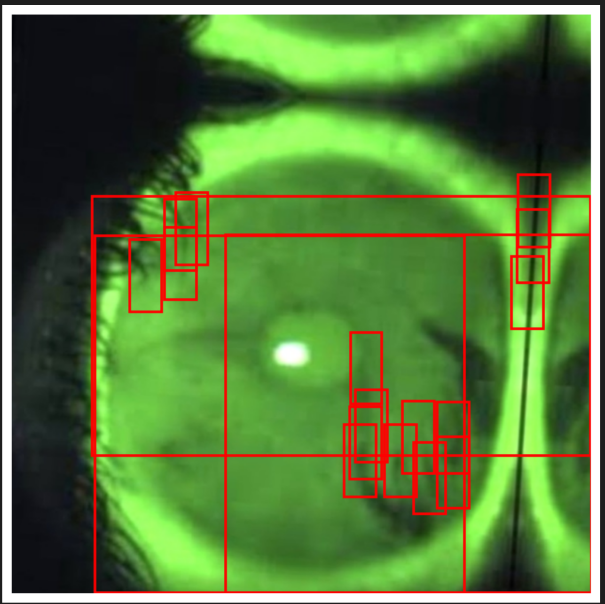

# Dry Eye Patch Detection using Mask R-CNN

## Project Overview
This repository contains a deep learning solution for automated detection of dry patches in eyes using **Mask R-CNN** for instance segmentation. The project applies advanced computer vision techniques to address a medically significant problem, demonstrating expertise in medical image analysis.

## Problem Statement
Dry eye syndrome affects millions worldwide. Accurate detection of dry patches is crucial for diagnosis and treatment planning. Manual detection is time-consuming and prone to errors. This project automates the detection process using state-of-the-art deep learning techniques.

## Models Implemented
- **Mask R-CNN**: A state-of-the-art instance segmentation model using ResNet-50 FPN backbone.
- The model was trained for 100 epochs with careful monitoring of validation metrics.

### Best Model
The best-performing model was saved at **Epoch 10**, achieving the highest F1-score during validation.

## Results
| Metric     | Value   |
|------------|---------|
| Precision  | 0.0136  |
| Recall     | 0.2000  |
| F1-Score   | 0.0254  |
| Accuracy   | 0.0129  |

## Repository Structure
